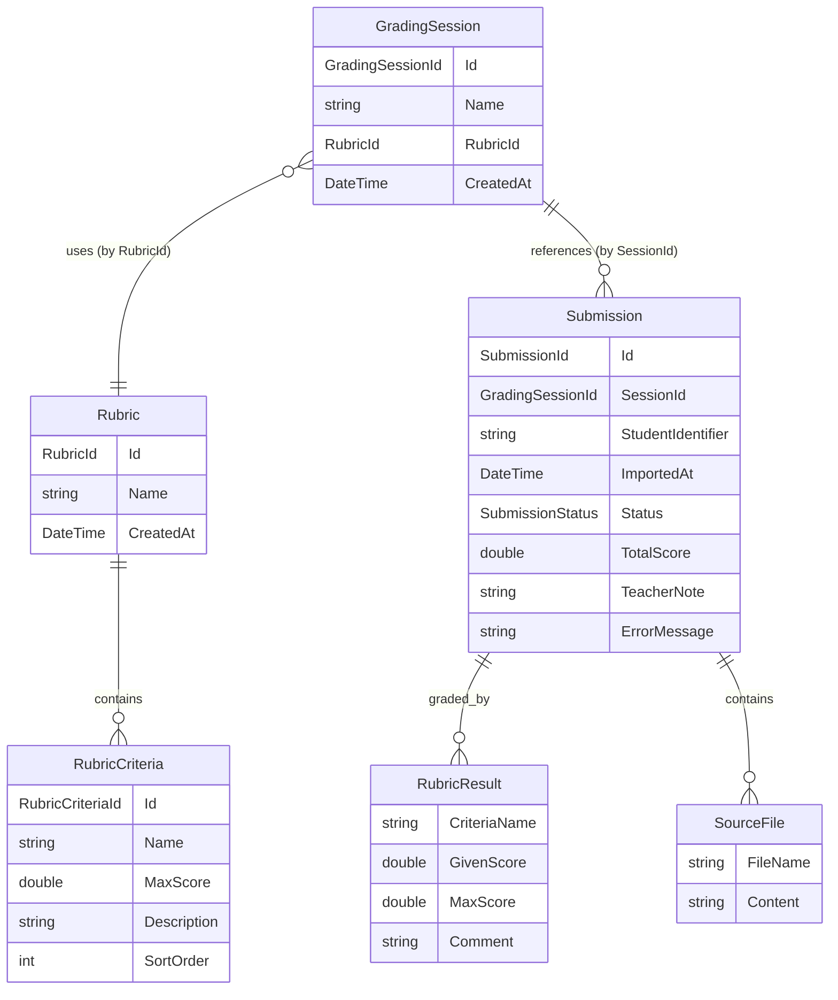
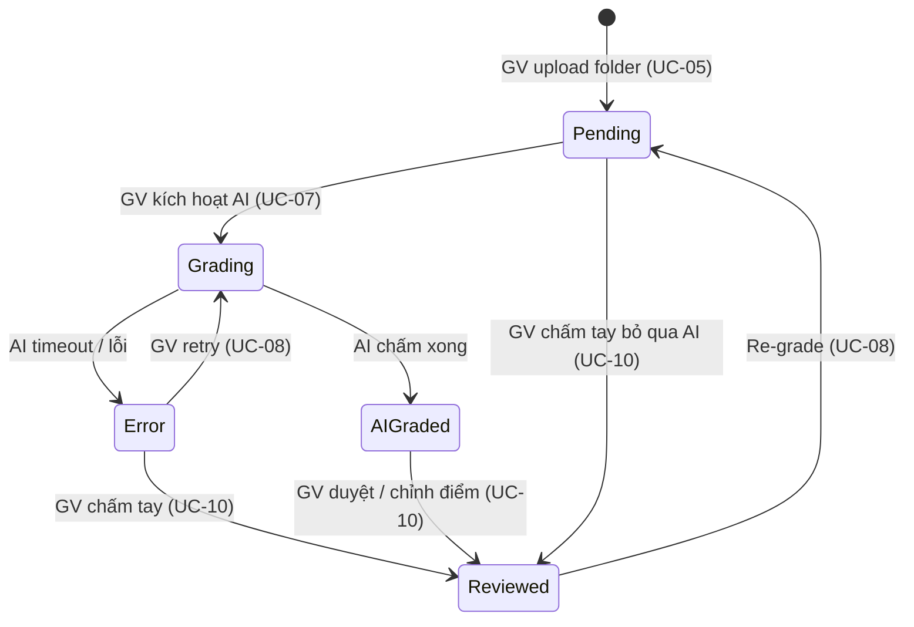

# Thiết kế Domain Model — HomeWorkJudge

> Ứng dụng local hỗ trợ giảng viên chấm bài tập lập trình bằng AI theo Rubric.
> Thiết kế dựa trên 14 Use Case đã xác định, theo chuẩn DDD.

---

## 1. Tổng quan Domain

### Aggregate Roots

| Aggregate Root | Chứa | Repository |
|---|---|---|
| **Rubric** | `List<RubricCriteria>` (child entities) | `IRubricRepository` |
| **GradingSession** | Metadata + reference tới Submission qua `SessionId` | `IGradingSessionRepository` |
| **Submission** | `List<SourceFile>`, `List<RubricResult>` (value objects) | `ISubmissionRepository` |

> **Quy tắc đã áp dụng:**
> - `GradingSession` **không** giữ `List<Submission>` bên trong — tránh aggregate quá lớn (50 bài × source code = rất nặng)
> - `Submission` là AR độc lập, link với `GradingSession` qua `SessionId`
> - Chỉ AR mới có Repository

### ER Diagram



---

## 2. Aggregate Roots & Entities

### 2.1 Rubric — Aggregate Root

Rubric là **độc lập**, tái sử dụng cho nhiều phiên chấm. GV tạo thủ công hoặc nhờ AI tạo bản nháp.

**Fields:**
* `Id` — `RubricId`
* `Name` — `string` — Tên rubric (VD: "Rubric bài sắp xếp mảng")
* `CreatedAt` — `DateTime`
* `Criteria` — `List<RubricCriteria>` — Danh sách tiêu chí (child entities)

**Methods:**
* `AddCriteria(name, maxScore, description)` — Thêm tiêu chí, validate tên không trùng
* `UpdateCriteria(criteriaId, name, maxScore, description)` — Sửa tiêu chí
* `RemoveCriteria(criteriaId)` — Xoá tiêu chí
* `ReorderCriteria(orderedIds)` — Sắp xếp lại thứ tự
* `GetMaxTotalScore()` — Tổng điểm tối đa = sum(MaxScore)
* `Clone(newName)` — Factory: tạo Rubric mới là bản sao với tên mới (UC-03)

**Invariants:**
* Rubric phải có ít nhất 1 tiêu chí trước khi dùng cho phiên chấm
* Tên tiêu chí không được trùng trong cùng 1 Rubric

---

### 2.2 RubricCriteria — Child Entity của Rubric

> Child Entity: có Id nhưng **không tồn tại độc lập** ngoài Rubric Aggregate. Không có Repository riêng.

**Fields:**
* `Id` — `RubricCriteriaId`
* `Name` — `string` — Tên tiêu chí (VD: "Tính đúng đắn")
* `MaxScore` — `double` — Điểm tối đa
* `Description` — `string` — Mô tả các mức điểm (Tốt/Khá/TB/Kém)
* `SortOrder` — `int` — Thứ tự hiển thị

---

### 2.3 GradingSession — Aggregate Root

Một phiên chấm = tên session + 1 rubric (by reference) + tập hợp Submission (by reference).
`GradingSession` **không** chứa `List<Submission>` trực tiếp để tránh aggregate quá nặng.

**Fields:**
* `Id` — `GradingSessionId`
* `Name` — `string` — Tên phiên (VD: "Bài 1 - Lớp CS101")
* `RubricId` — `RubricId` — Reference tới Rubric (không embed object Rubric vào)
* `CreatedAt` — `DateTime`

**Methods:**
* `Rename(newName)` — Đổi tên phiên

> Thống kê (TB, Min, Max, số bài chờ review...) được tính ở tầng **Application** bằng cách query `ISubmissionRepository`, không đặt trên GradingSession.

**Invariants:**
* `Name` không được rỗng

---

### 2.4 Submission — Aggregate Root

Một bài nộp = source code 1 SV (giải nén từ zip) + kết quả chấm. Đây là AR quan trọng nhất, được thao tác liên tục trong quá trình chấm.

**Fields:**
* `Id` — `SubmissionId`
* `SessionId` — `GradingSessionId` — Reference tới GradingSession
* `StudentIdentifier` — `string` — Tên file gốc, bỏ phần mở rộng (VD: `2021001.zip` → `2021001`)
* `SourceFiles` — `List<SourceFile>` — Danh sách file source code (giải nén từ zip, lưu dạng JSON column)
* `ImportedAt` — `DateTime` — Thời điểm import
* `Status` — `SubmissionStatus`
* `TotalScore` — `double`
* `RubricResults` — `List<RubricResult>` — Kết quả từng tiêu chí (value objects)
* `TeacherNote` — `string?` — Ghi chú GV
* `ErrorMessage` — `string?` — Thông báo lỗi khi AI fail

**Methods:**
* `StartGrading()` — Pending → Grading; guard: chỉ cho phép từ Pending/Error
* `AttachAIResults(results)` — Lưu kết quả AI, tính tổng → AIGraded; validate điểm trong phạm vi
* `MarkError(errorMessage)` — Đánh dấu AI lỗi → Error
* `Approve()` — GV duyệt giữ nguyên điểm AI → Reviewed
* `OverrideCriteriaScore(criteriaName, newScore, comment)` — GV sửa 1 tiêu chí → tính lại TotalScore; guard: `0 ≤ newScore ≤ MaxScore`
* `OverrideTotalScore(newScore)` — GV ghi đè tổng điểm; guard: `newScore ≥ 0`
* `ResetForRegrade()` — Reset Pending, xoá RubricResults, xoá ErrorMessage (UC-08)
* `AddTeacherNote(note)` — Thêm/cập nhật ghi chú

**Invariants:**
* `TotalScore ≥ 0`
* Chỉ được `AttachAIResults` khi Status = Grading
* Chỉ được `Approve/Override` khi Status = AIGraded

---

## 3. Value Objects

> Value Objects: **không có Id**, immutable, định danh bởi giá trị.

### SourceFile

```csharp
public record SourceFile(
    string FileName,    // VD: "main.cpp", "utils.h"
    string Content      // Nội dung file
);
```

> Lưu trong DB dưới dạng **JSON column** trong SQLite.
> Khi gửi cho AI, format thành:
> ```
> [main.cpp]
> #include <iostream>
> ...
> [utils.h]
> #pragma once
> ...
> ```

### RubricResult

```csharp
public record RubricResult(
    string CriteriaName,    // Tên tiêu chí
    double GivenScore,      // Điểm được cho
    double MaxScore,        // Điểm tối đa
    string Comment          // Nhận xét AI hoặc GV
);
```

---

## 4. Strongly-typed IDs

```csharp
public readonly record struct RubricId(Guid Value);
public readonly record struct RubricCriteriaId(Guid Value);
public readonly record struct GradingSessionId(Guid Value);
public readonly record struct SubmissionId(Guid Value);
```

---

## 5. Enums

```csharp
public enum SubmissionStatus
{
    Pending,     // Đã import, chưa chấm
    Grading,     // AI đang xử lý
    AIGraded,    // AI chấm xong, chờ GV review
    Reviewed,    // GV đã duyệt / chốt điểm
    Error        // AI chấm lỗi
}
```

---

## 6. Domain Events

| Event | Raise ở đâu | Mục đích |
|---|---|---|
| `SubmissionsImportedEvent` | `Submission` constructor (batch) | Cập nhật UI: hiển thị danh sách bài nộp |
| `SubmissionGradingStartedEvent` | `Submission.StartGrading()` | Hiển thị progress bar |
| `SubmissionAIGradedEvent` | `Submission.AttachAIResults()` | Cập nhật progress (x/n bài) |
| `SubmissionAIFailedEvent` | `Submission.MarkError()` | Hiển thị cảnh báo lỗi |
| `SubmissionReviewedEvent` | `Submission.Approve()` / override methods | Cập nhật trạng thái bảng điểm |

---

## 7. Ports (Interfaces)

### Inbound — Repositories

```csharp
// Rubric AR
public interface IRubricRepository
{
    Task<Rubric?> GetByIdAsync(RubricId id);
    Task<IReadOnlyList<Rubric>> GetAllAsync();
    Task<IReadOnlyList<Rubric>> SearchByNameAsync(string keyword);
    Task AddAsync(Rubric rubric);
    Task UpdateAsync(Rubric rubric);
    Task DeleteAsync(RubricId id);
}

// GradingSession AR
public interface IGradingSessionRepository
{
    Task<GradingSession?> GetByIdAsync(GradingSessionId id);
    Task<IReadOnlyList<GradingSession>> GetAllAsync();
    Task AddAsync(GradingSession session);
    Task UpdateAsync(GradingSession session);
    Task DeleteAsync(GradingSessionId id);
}

// Submission AR
public interface ISubmissionRepository
{
    Task<Submission?> GetByIdAsync(SubmissionId id);
    Task<IReadOnlyList<Submission>> GetBySessionIdAsync(GradingSessionId sessionId);
    Task<IReadOnlyList<Submission>> GetByStatusAsync(GradingSessionId sessionId, SubmissionStatus status);
    Task<int> CountBySessionIdAsync(GradingSessionId sessionId);
    Task AddRangeAsync(IEnumerable<Submission> submissions);
    Task UpdateAsync(Submission submission);
    Task UpdateRangeAsync(IEnumerable<Submission> submissions);
}

public interface IUnitOfWork
{
    Task<int> SaveChangesAsync(CancellationToken ct = default);
}
```

### Outbound — Infrastructure Ports

```csharp
// AI chấm bài theo rubric (UC-07)
public interface IAiGradingPort
{
    Task<AiGradingResultDto> GradeAsync(
        IReadOnlyList<SourceFile> sourceFiles,
        IReadOnlyList<RubricCriteria> criteria,
        CancellationToken ct = default);
}

// AI tạo rubric gợi ý (UC-02)
public interface IAiRubricGeneratorPort
{
    Task<IReadOnlyList<RubricCriteriaDto>> GenerateRubricAsync(
        string assignmentDescription,
        CancellationToken ct = default);
}

// Giải nén file zip/rar → danh sách SourceFile (UC-05)
// Chỉ trả về SOURCE CODE files — bộ lọc nằm hoàn toàn ở implementation:
//   ✅ Whitelist extension: .c, .cpp, .h, .hpp, .cs, .java, .py, .js, .ts, .go, .rs, .kt, .rb, .php, .html, .css, .txt, .md
//   ❌ Bỏ qua binary:      .dll, .exe, .class, .o, .obj, .pyc, .pyd, .pyo, .jar
//   ❌ Bỏ qua artifacts:   bin/, obj/, build/, dist/, node_modules/, __pycache__/, .vs/, .idea/
//   ❌ Bỏ qua OS files:    .DS_Store, Thumbs.db, desktop.ini
public interface IFileExtractorPort
{
    Task<IReadOnlyList<SourceFile>> ExtractAsync(
        string filePath,
        CancellationToken ct = default);
}

// Xuất báo cáo CSV/Excel (UC-12)
public interface IReportExportPort
{
    Task<byte[]> ExportAsync(
        ReportDataDto data,
        ReportFormat format,
        CancellationToken ct = default);
}
```

---

## 8. Vòng đời Submission (State Machine)



---

## 9. Mapping UC → Domain

| UC | Domain Method / Port |
|---|---|
| UC-01 | `new Rubric()` + `AddCriteria()` → `IRubricRepository.AddAsync()` |
| UC-02 | `IAiRubricGeneratorPort.GenerateRubricAsync()` → `new Rubric()` |
| UC-03 | `Rubric.UpdateCriteria()` / `RemoveCriteria()` / `Clone()` |
| UC-04 | `IRubricRepository.GetAllAsync()` / `SearchByNameAsync()` |
| UC-05 | `new GradingSession()` + `IFileExtractorPort.ExtractAsync()` + `new Submission()` × n |
| UC-06 | `IGradingSessionRepository.GetAllAsync()` + `ISubmissionRepository.CountBySessionIdAsync()` |
| UC-07 | `Submission.StartGrading()` → `IAiGradingPort.GradeAsync()` → `AttachAIResults()` / `MarkError()` |
| UC-08 | `Submission.ResetForRegrade()` → UC-07 |
| UC-09 | `ISubmissionRepository.GetByIdAsync()` |
| UC-10 | `Submission.Approve()` / `OverrideCriteriaScore()` / `OverrideTotalScore()` |
| UC-11 | `ISubmissionRepository.GetBySessionIdAsync()` → tính thống kê ở Application layer |
| UC-12 | `IReportExportPort.ExportAsync()` |
| UC-13 | Cấu hình app settings (ngoài domain) |
